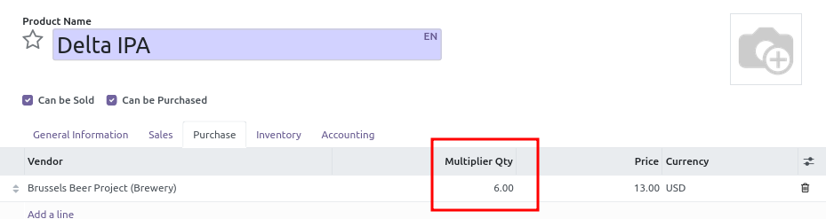

- Go to Purchase \> Products \> Products.
- Select a product.
- Go to the 'Purchase' tab and edit a vendor pricelist line to set
  'Multiplier Qty' to 6.0

To allow skipping this multiplier on specific purchase orders, the field
'Bypass vendor pricelist Qty. Multiplier' is available on the purchase order.

(If you can't find that column, you can activate it by clicking the
three dots at the corner of the table and enabling it).

