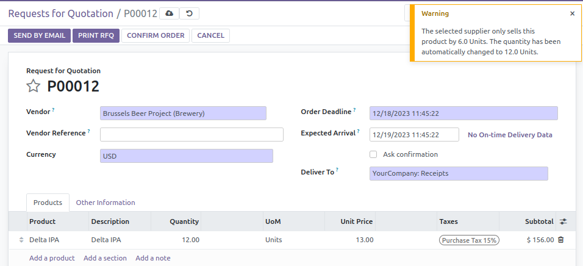

- Create a new purchase order.
- Assign it to the partner where the multiplier quantity was previously set.
- Add a product line with the previously edited product.
- Quantity is set to 6.0 by default (based on the vendor multiplier).
- If you set 9.0 in the quantity field, the quantity will be rounded up to
  12.0 unless the 'Bypass vendor pricelist Qty. Multiplier' flag is enabled on the purchase order.

