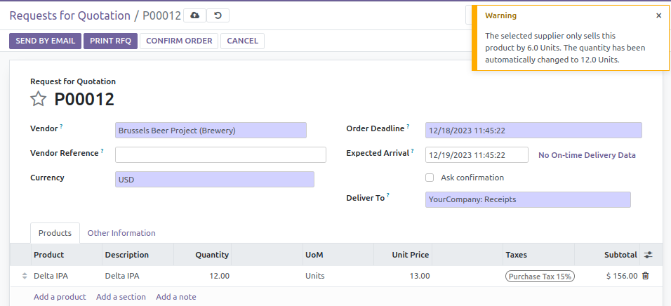

* Create a new purchase order.
* Assign it to the partner where the multiplier quantity was previously set.
* Add a product line with the previously edited product.
* Quantity is set to 6.0.
* If you set 9.0 in the quantity field, the quantity will be rounded up to 12.0

