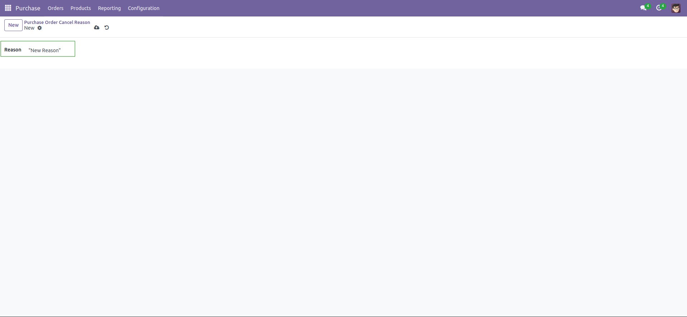

1. Go to Menu Purchase -> Configuration -> Purchase Order Cancel Reason

2. By default you already have three Purchase Cancel Reason available:
 - Just for Quotation
 - Service no longer needed
 - Other Service Provider selected

3. Create a new Purchase Cancel Reason
Click on 'New'

Add in the field 'Reason' your new reason. 

