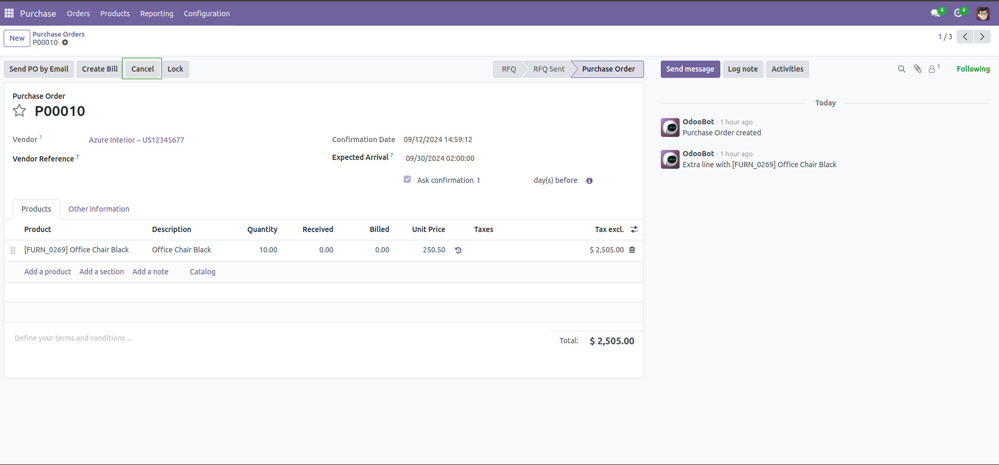
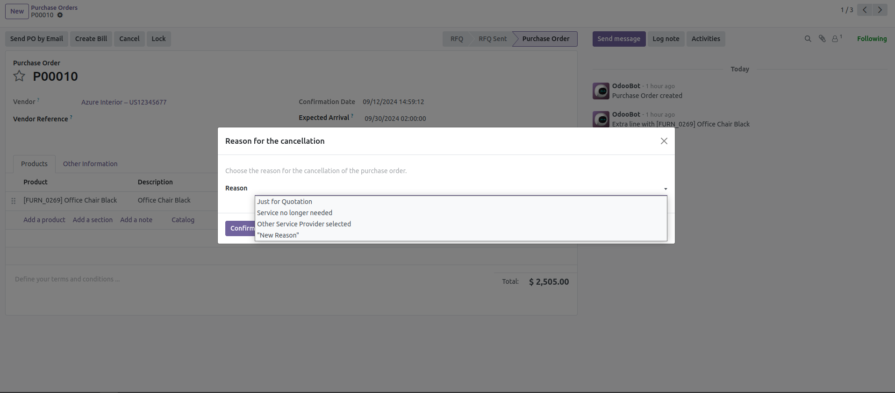

- During purchase order state equal to Draft, RFQ Sent or Purchase Order
- Click at "Cancel" button, a wizard will show a list of cancel reasons

- Choose a reason and confirm cancellation, the reason will be stamped in the purchase order