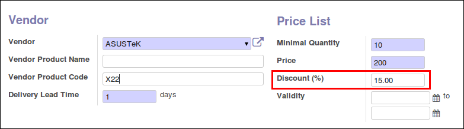
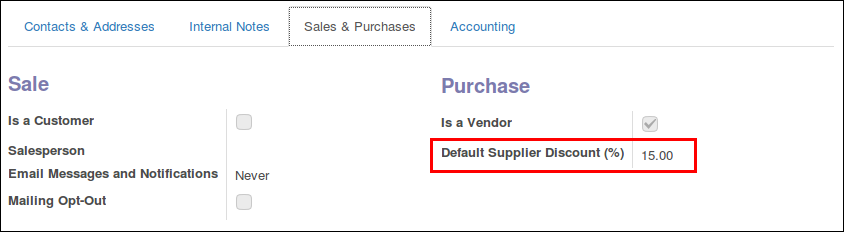

This module allows to define a discount per line in the purchase orders. This
discount can be also negative, interpreting it as an increment.

It also modifies the purchase order report to include the discount field in it.

This module allows to input a discount in the supplier info form, and propagate
it to purchase order lines:

* The discount appears explicitly in purchase orders instead of being directly
  discounted in price.
* You can set prices and discounts on the same screen.

* A new field default_supplierinfo_discount is added on res.partner model.
  This value will be used as the default one, on each supplierinfo of that
  supplier.

Note: this setting is a new 'company' setting, unavailable for related
partners, as accounting-related Settings.

.. image:: ../static/description/res_partner_individual_form.png
