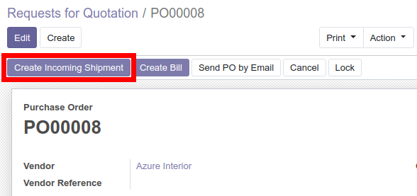
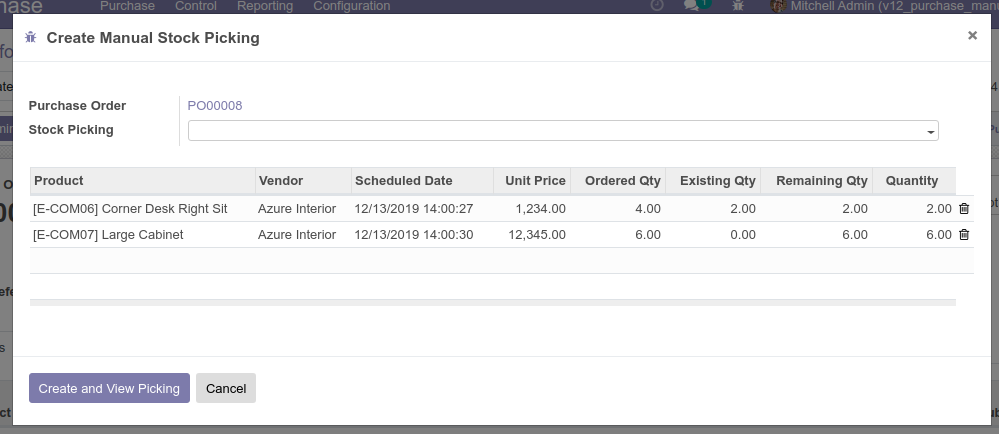

There are two main ways to use this module:

* From Purchase Order

When creating a purchase order and confirming it, no picking will be automatically created.
Lines with pending quantities to receive will appear in blue color, to create
the manual picking press the button "Create Incoming Shipment":

This will trigger the wizard that lets the user choose which lines should be taken for the
creation of the picking and also the quantities. Clicking on the "Create and View Picking"
will create the reception and redirect the user to the picking form.

* From Purchase Order Line

The module adds a new list view for Purchase Order Lines (in Purchase Menu). From there you can select multiple
PO lines (in this base module only PO lines from same PO can be selected) and create the
manual delivery. Follow the same steps as above to manually generate the incoming shipment.
