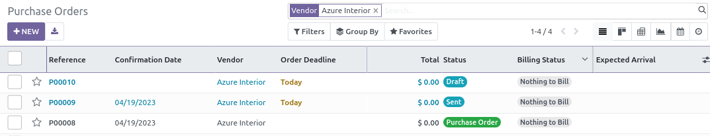
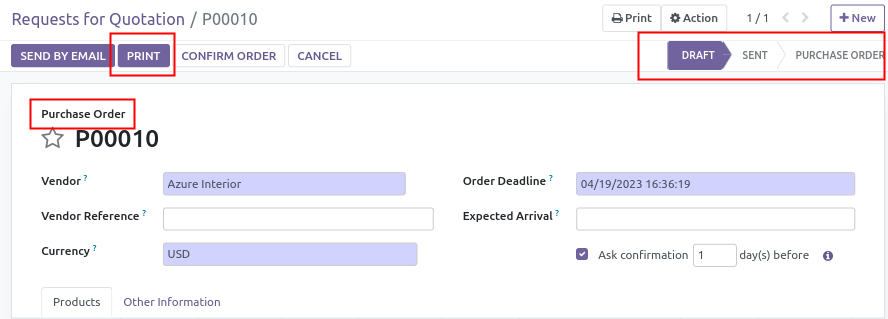

This module extends the odoo purchase module, to remove 'Request for
Quotation' state, simplifying the workflow for the end users.

Once installed :

- The menu item 'Purchase \> Purchase \> Requests for Quotation' is
  hidden. A single menu item 'Purchase Order' is available
- The states names of the purchase order is altered. 'RFQ' is replaced
  by 'Draft' and 'RFQ sent' by 'Sent'.
- The colors in the tree view is correctly set to `decoration-info` for
  'draft' and 'sent' orders.

- In the form view, all the RFQ names are removed or replaced by
  'Purchase Order'. The module makes also the 'Print' button allways
  available and not only on 'draft' and 'sent' status.
- The option 'Print \> Request For quotation' is also disabled.

