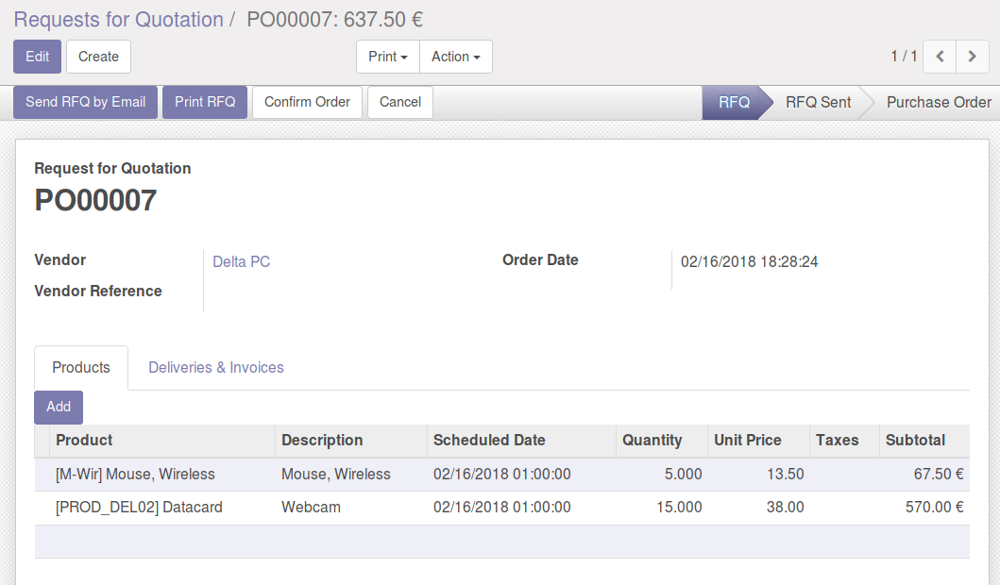
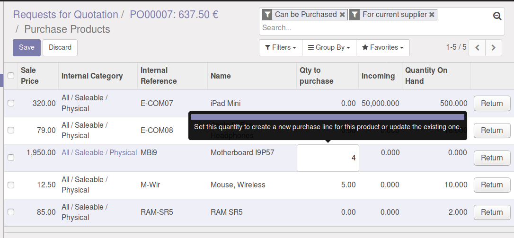
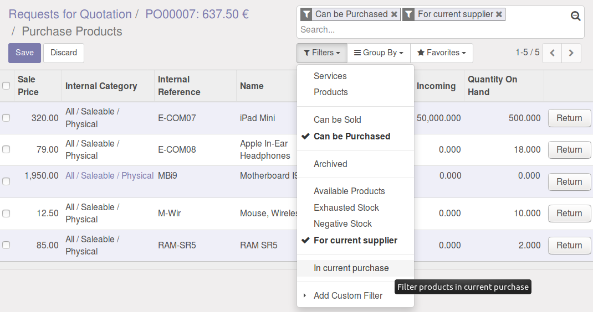

Inside a purchase order, you can click on "Add products", to open a product tree view, then update "qty to purchase" field.

|

|

|

The update of "qty to purchase" will add new purchase line or update the existing line. If qty to purchase is 0 it purchase line will deleted if it exists.

|
