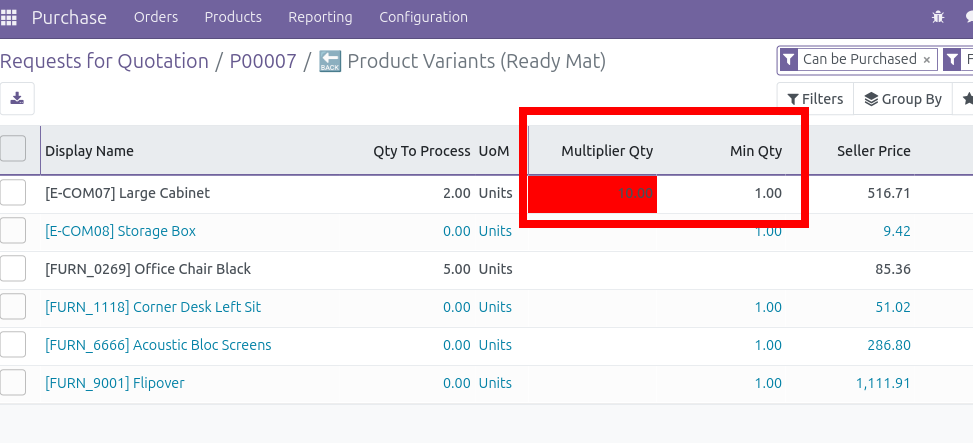

This module extends the OCA `purchase_quick` module to add extra fields
to display that comes from `product_supplierinfo_qty_multiplier` modules.

This module force right input quantity (superior to min and compliant with multiplier). It adds temporarly a background red color warning, if quantity are not compliant with the supplier settings.
