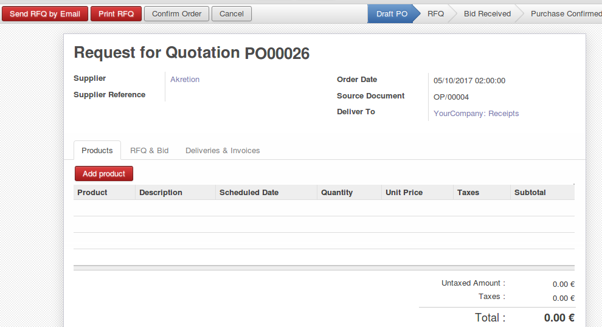
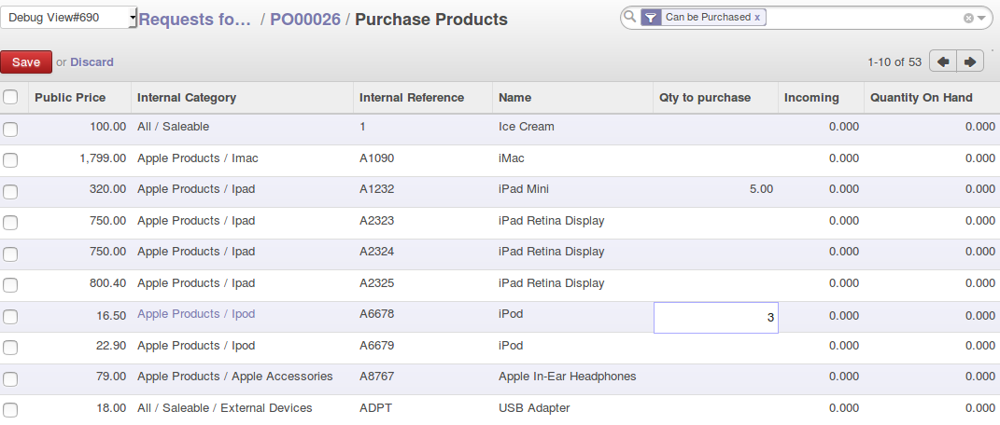
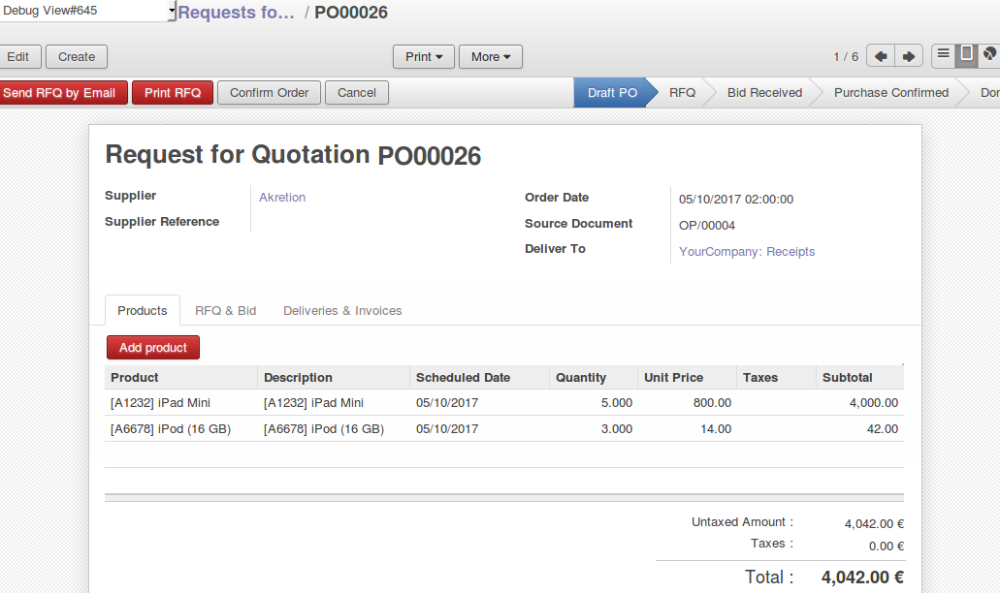
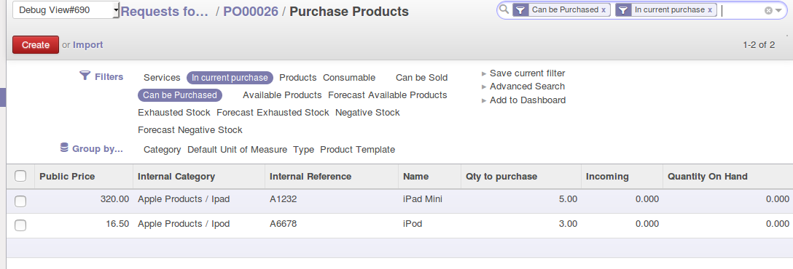

.. image:: https://img.shields.io/badge/licence-AGPL--3-blue.svg
   :target: http://www.gnu.org/licenses/agpl-3.0-standalone.html
   :alt: License: AGPL-3

==============
Quick Purchase
==============
This module gives the possibility
to add easily product into the purchase order (mass line add/update).

Usage
=====

Inside a purchase order, you can click on "Add products", to open a product tree view, then update "qty to purchase" field.

.. image:: quick_purchase/static/description/01_purchase_order_create.png
    :width: 800 px
    :alt: Purchase order create

|

|

.. image:: quick_purchase/static/description/02_purchase_order_add_product.png
    :width: 800 px
    :alt: Purchase order Add product

|

|

The update of "qty to purchase" will add new purchase line or update the existing line. If qty to purchase is 0 it purchase line will deleted if it exists.

|

.. image:: quick_purchase/static/description/03_purchase_order_updated.png
    :width: 800 px
    :alt: Purchase order updated

|

|

.. image:: quick_purchase/static/description/04_purchase_order_update_product_qty.png
    :width: 800 px
    :alt: Purchase order update product qty.

|

|

.. image:: https://odoo-community.org/website/image/ir.attachment/5784_f2813bd/datas
   :alt: Try me on Runbot
   :target: https://runbot.odoo-community.org/runbot/purchase-workflow/8.0

|

Bug Tracker
===========

Bugs are tracked on `GitHub Issues
<https://github.com/OCA/purchase-workflow/issues>`_. In case of trouble, please
check there if your issue has already been reported. If you spotted it first,
help us smash it by providing detailed and welcomed feedback.

Images
------

* Odoo Community Association: `Icon <https://github.com/OCA/maintainer-tools/blob/master/template/module/static/description/icon.svg>`_.

Contributors
------------

* Sébastien BEAU <sebastien.beau@akretion.com>
* Mourad EL HADJ MIMOUNE <mourad.elhadj.mimoune@akretion.com>

Maintainer
----------

.. image:: https://odoo-community.org/logo.png
   :alt: Odoo Community Association
   :target: https://odoo-community.org

This module is maintained by the OCA.

OCA, or the Odoo Community Association, is a nonprofit organization whose
mission is to support the collaborative development of Odoo features and
promote its widespread use.

To contribute to this module, please visit https://odoo-community.org.
